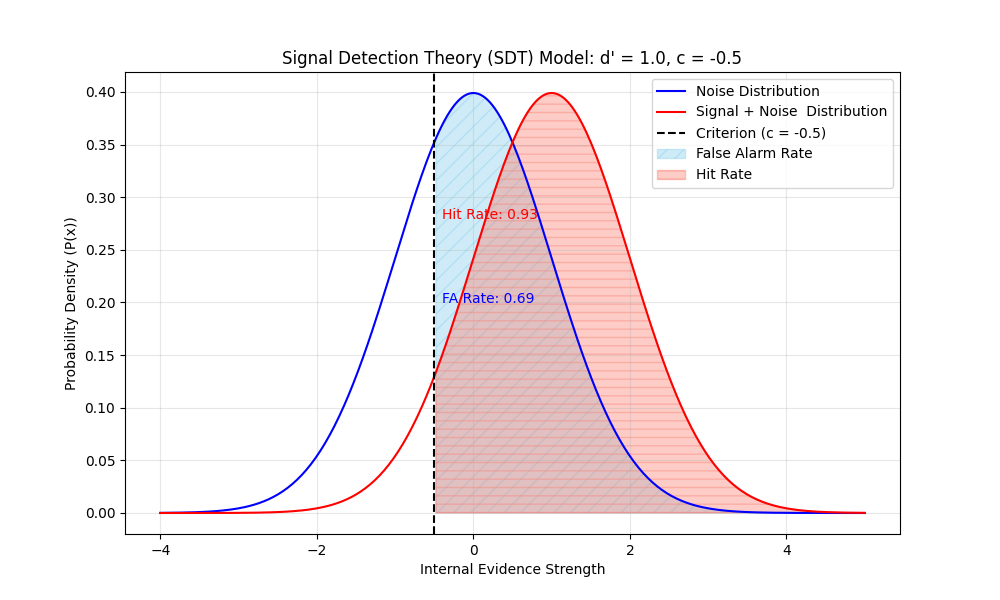

# Signal Detection Theory (SDT) Cognitive Model

This project is a Python-based simulation and visualization of **Signal Detection Theory (SDT), a core mathematical model used in cognitive science to measure decision-making under uncertainty. 
This script models how an observer's sensitivity ($d'$) and response bias ($c$) interact to produce measurable **Hit Rates** and **False Alarm Rates**.

This project demonstrates proficiency in:
* **Python** for scientific computing and quantitative modeling.
* **NumPy** for array manipulation.
* **SciPy** for statistical calculations (`norm.pdf`, `norm.sf`).
* **Matplotlib** for data visualization and annotation.

---

## Analysis 1: The Conservative Responder (Baseline)

This model simulates an observer with moderate sensitivity ($d' = 1.0$) and a **conservative bias** ($c = 0.5$). This observer requires a high level of internal evidence before saying "yes."

* **Parameters:** $d' = 1.0$, $c = 0.5$
* **Metrics:** Hit Rate: 0.6915, False Alarm Rate: 0.3085
* **Interpretation:** The observer prioritizes avoiding false alarms. This is visible in the graph because the Criterion is shifted toward the Signal distribution, leaving a large area of the Noise distribution (blue) as a Correct Rejection.

---

## Analysis 2: The Liberal Responder

This model simulates an observer with the *same sensitivity* ($d' = 1.0$) but a **liberal bias** ($c = -0.5$). This observer is willing to say "yes" even with very little internal evidence.

* **Parameters:** $d' = 1.0$, $c = -0.5$
* **Metrics:** Hit Rate: 0.9332, False Alarm Rate: 0.6915
* **Interpretation:** By shifting their criterion to the left, the observer's **Hit Rate increases dramatically to 93%**. However, this comes at a significant cost: their **False Alarm Rate also skyrockets to 69%**. This models a "yes-man" strategy, demonstrating the inherent trade-off in SDT.

---

## Conclusion

This simulation shows how SDT can mathematically model different cognitive strategies. By changing the $c$ parameter (bias) while holding $d'$ (sensitivity) constant, we can precisely quantify the trade-off between maximizing Hits and minimizing False Alarms.
